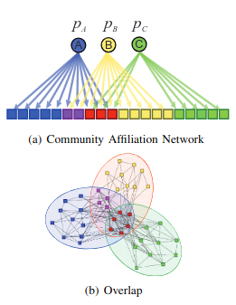

# This is a fork from <a href="https://github.com/snap-stanford/snap">SNAP</a>repository!!!
```
========================================================================
  SNAP : Stanford Network Analysis Platform
	http://snap.stanford.edu
========================================================================
```
## Objective:
Simply modified the file agmgen to generate also weights comming from exponential distribution if a lambdas vector is passed or add the cluster number that generated the edge

### Added/modified files:
- examples/agmgen2/*
- snap-adv/agm2.h
- snap-adv/agm2.cpp
- Makefile
- install_in_linux.sh

### install_in_linux.sh
This file simply calls makefile and generate the modified agmgen2 executable file. It also copies the executable file to the parent folder
- Usage: bash install_in_linux.sh

### agmgen
This executable file outputs a txt file containing the edges of an undirected graph in the format "u v w", with vertices u and v and an additional information w. "w" can be either the weight of the edge, when the `$\Lambda$` 's vector is passed, or is an integer indicating the intersection community between u and v that generated the edge.

        Parameters:
            -i: Community affiliation data (one group per line). 
                Use 'DEMO' to consider a simple case where Nodes 0-24 belong to 
                first community, and nodes 15-39 belong to the second community.
                Also check 'community_affilications.txt' for an example.
            -o: Output filename prefix (The edges of the generated graph).
            -a: Power-law coefficient of the distribution of edge probability 
                inside each community.
            -c: Scaling constant for the edge probability.
            -l: The lambdas for exponential distributed weights
            -probs: the list with probability of edge inside each community
            -pn: probability of edge between two disjoint vertices. When -1 the probability is 0.

```python
        subprocess.run(["./agmgen",\
                            f"-i:{bipartite_file}",\
                            f"-a:{a}",\
                            f"-c:{c}",\
                            f"-o:{output_file}",\
                            "-l:%s"%str_lambdas,\
                            "-p:%s"%str_probs,\
                            f"-pn:{pn}"]
                       )
```
example of usage:
```python
import numpy as np
import subprocess
k=3
probs = [str(round(i,2)) for i in np.random.uniform(0,1,k)]
str_probs = ",".join(probs)
lambdas = [str(round(i,2)) for i in np.random.rand(k+1)]
str_lambdas = ",".join(lambdas)
pn=-1

subprocess.run(["./agmgen","-i:bipartite.txt", "-a:0.6", "-c:1.3", "-o:agm_net.txt", "-l:%s"%str_lambdas, "-p:%s"%str_probs,f"-pn:{pn}"]) 
```
## Important:
You must provide a bipartite graph file as input, which must follow this format:
```
1 3 4 9 12 13 16
0 2 5 8 14 18
2 7 9 10 11 13 14 15 19
```
Each line lists the vertices belonging to one community (or that is connected to a community vertice in the bipartite network). The bipartite network constains in one side the vertices of the graph, and in the other side the communities (which are the vertices 20, 21, 22 ommited in the file).




taken from <a href="https://cs.stanford.edu/people/jure/pubs/agmfit-icdm12.pdf"> here </a>